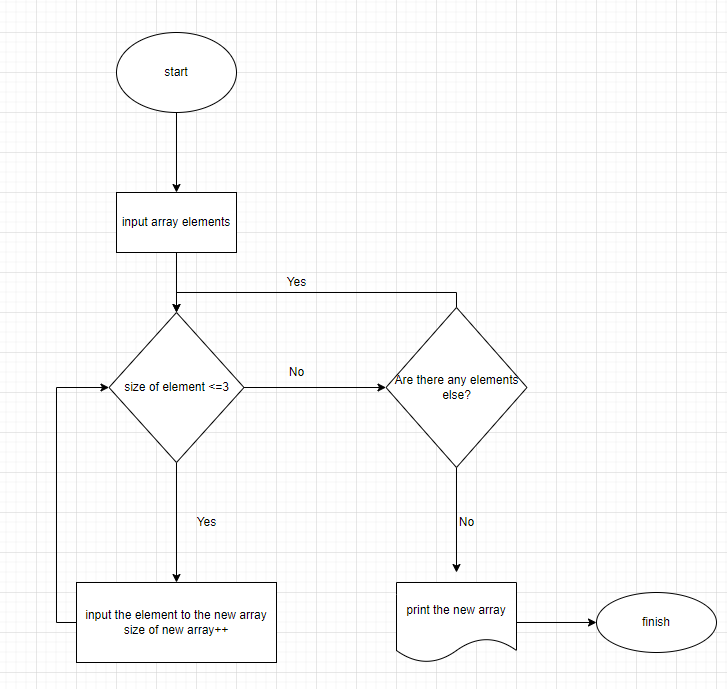

# **Итоги блока**
При выполнении итогового задания необходимо:
1. Создать репозиторий на GitHub
2. Нарисовать блок схему алгоритма решения задачи
3. Снабдить репозиторий оформленным текстовым описанием решения (файл README.md)
4. Написать программу, решающую поставленную задачу
5. Использовать контроль версий в работе над этим небольшим проектом

## **Условия задачи:**
Написать программу, которая из имеющегося массива строк формирует массив из строк, длина элементов которого меньше либо равта 3 символа. Первоначальный массив можно ввести с клавиатуры, либо задать на старте выполнения алгоритма. При решении не рекомендуется пользоваться коллекциями, лучше обойтись исключительно массивами.

*Примеры:*

*["hello", "2", "world", ":-)"] -> ["2", ":-)"]*

*["1234", "1567", "-2", "computer science"] -> ["-2"]*

*["Russia", "Denmark", "Kazan"] -> []*

## Создание репозитория на GitHub
На GitHub был создан репозиторий https://github.com/OlgaLob/Pre_final.git
## Блок - схема алгоритма

## Алгоритм решения задачи

1. Перебираем значения исходного массива.
2. Проверяем каждое знаение массва по очереди на соответствие условию: длина элемента меньше или равна трем.
3. Если условия выполняются выбранным элементом из исходного массива заполняем новый массив.
4. Повторяем пункты 2 и 3 до тех пор пока не достигнем конца исходного массива.
5. Возращаем новый заполненый массив как результат.